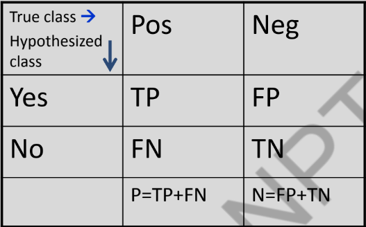
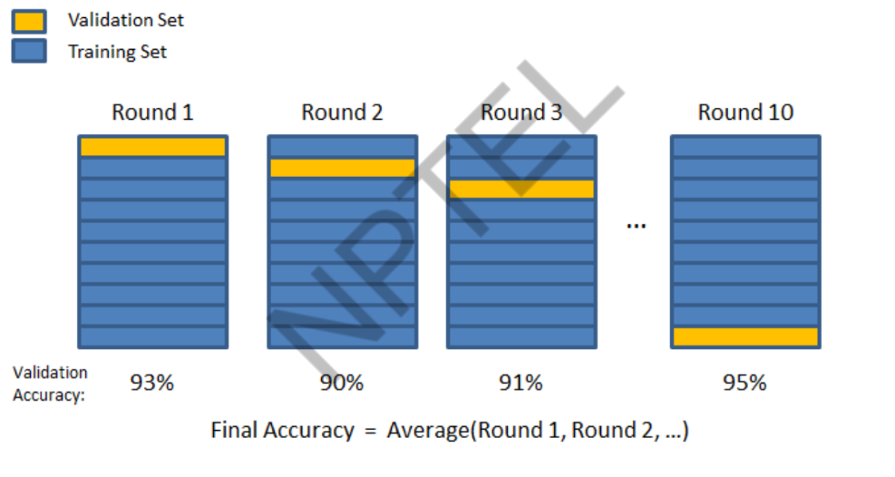

# Evaluation and Cross Validation
- Evaluation the perfomance of learning system is important because:   
  - Learning systems are usually designed to predict the class of "future" unlabelled data.  
 
- Typical choices of Perfomance Evaluation:
  - Error
  - Accuracy
  - Precision/Recall  
 
- Typical choices:
  - Train/Test Sets
  - K-Fold Cross Validation

## Evaluation Prediction
Suppose we want to make prediction of a value for a target feature on example $x$:
  - $y$ is the observed value for target feature on example $x$.
  - $\hat{y}$ is the predicted value for target feature on $x$.
  - How is the Error measured?

  ## Measures of Error

  1. Absolute Error: $\frac{1}{n}|f(x) - y|$
  2. Sum of Squared Error (MSE): $\frac{1}{n}\Sigma_{i=1}^n(f(x) - y)^2$
  3. Number of Miscalculations: $\frac{1}{n}\Sigma_{i=1}^n\delta(f(x) - y)$
  4. $\delta(f(x), y)$ is 1 if $f(x) \neq y$, and $0$ otherwise.  

  

- Accuracy: $\frac{(TP + PN)}{(P+N)}$  

- Precision: $\frac{TP}{(TP+FP)}$  

- Accuracy: $\frac{TP}{P}$  

- Accuracy: $\frac{FP}{N}$  

## Sample Error and True Error  
- The Sample Error of hypothesis $f$ with respect to target function c and data sample S is :  
$error_s(f) = \frac{1}{n} \sum_{x\in s}\delta(f(x), c(x))$
- The **true error** (denoted $error_D(f)$) of hypothesis $f$ with respect to target function $c$ and distribution $D$, is the probability that $h$ will misclassify an instance drawn at random according to $D$.  
$error_D(f) = Pr_{x\in D}[f(x) \neq c(x)]$  

## Why Errors?
Errors in Learning are caused by:
- Limited Representation (representation bias)
- Limited Search (search bias)
- Limited Data (variance)
- Limited Features (noise)  

## Difficulties in evaluating hypothesis with limited data.  
- Bias in the Estimate: The sample error is a poor estimator of the true error.
  - ==> Test the hypothesis on an independent test set.
- We divide the example into:
  - Training examples that are used to train the learner .
  - Test example is used to evaluate the learner.
- Variance in the Estimate: The smaller the test set, the greater the expected variance.

## K-fold cross validation
1. Split the Data into $k$ equal subsets.
2. Perform $k$ rounds of learning; on each round 
   - 1/k of the Data is held out as a test set and remaining examples are used as training set.
3. Compute the average test set score of the $k$ rounds.   

## Trade off  
In Machine Learning there's always a tradeoff between:
  - complex hyptheses that fit the training data well.
  - simpler hypotheses that may generalize the data well.

As the amount of training data increases, error in generalization decreases.