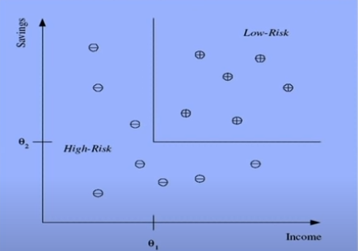
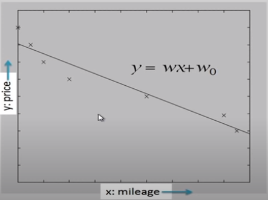

# Supervised Learning
Supervised learning is a type of machine learning where the algorithm is trained on a labeled dataset, meaning it is provided with input data along with corresponding correct outputs or "labels." The goal of the algorithm is to learn a mapping between the input data and their corresponding outputs so that it can make accurate predictions on new, unseen data.

In simple terms, it's like a teacher guiding a student during the learning process. The teacher (algorithm) is shown examples of inputs and their correct answers, and it learns from these examples to make predictions on its own later.

For example, we want to build a cat or dog filter through image. The dataset for the algorithm to predict will be:

- Image 1: [image of a cat] - Label: "cat"
- Image 2: [image of a dog] - Label: "dog"
- Image 3: [image of a cat] - Label: "cat"
- ...

# Unsupervised Learning
Unsupervised learning is a type of machine learning where the algorithm learns from unlabeled data without explicit guidance or predefined outcomes. In other words, it tries to find patterns and structures within the data without knowing the correct answers beforehand.

Imagine you have a collection of various fruits, but none of them are labeled with their names. Your task is to group these fruits based on similarities, without any information about their names or categories. This is where unsupervised learning comes in.

An unsupervised learning algorithm would analyze the features of the fruits (like color, shape, size, and texture) and try to group them into clusters based on their similarities.

# Semi-supervised Learning
Semi-supervised learning is a type of machine learning that falls between supervised and unsupervised learning. In semi-supervised learning, the algorithm is trained using a combination of labeled and unlabeled data.

In semi-supervised learning, you utilize both the labeled and unlabeled images during the training process. The algorithm learns from the labeled data as in supervised learning, but it also leverages the unlabeled data to improve its understanding of the underlying structure and relationships in the data.

Effective when labelled data is limited.

---

# Regression and Classification

## Classification:
$\rightarrow$ Predicting a categorical output such as if an email is spam or not, image is cat or dog, sentiment of text (positive, negative, neutral), etc. 
Example: Credit scoring.
Differentiation between low-risk and high-risk customers from their income and savings.

From the observation, it can be noticed that if income > $\theta_1$ AND savings > $\theta_2$ THEN low-risk ELSE high-risk.

## Regression:
the goal is to predict a continuous output or a numerical value. In other words, it involves modeling the relationship between input variables and a continuous target variable. The output of a regression model can be any real number within a certain range. For example, predicting house prices, stock prices, or a person's age are all regression problems.

Example: Price of a used car   
$x:$ car attributes (mileage)  
$y:$ price

> $y=f(x)$ 
$f(\space) \space model, x \space parameters$ 

---
# Feature
A Feature, also known as a feature variable or attribute, refers to an individual measurable property or characteristic of the data used to make predictions or train a machine learning model. Features are essential components of the input data that help the model understand patterns, relationships, and information relevant to the learning task.

For example, let's consider a dataset of houses with various properties like size, number of bedrooms, number of bathrooms, location, and age. In this case, each property such as "size," "number of bedrooms," "number of bathrooms," "location," and "age" is a feature.