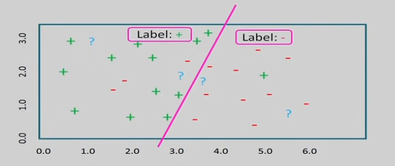
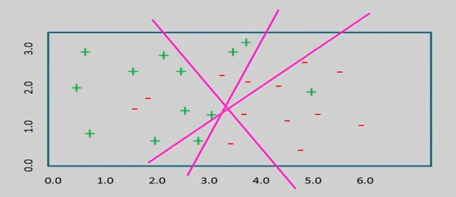

# Inductive Learning/Prediction   

Examples are given $\rightarrow$ $(x, \space y)$ or $(x,\space f(x))$. Where $x$ is the input and $y$ is the output parameter.  

Classification $\rightarrow$ $f(x)$ is discrete.  
Regression $\rightarrow$ $f(x)$ is continuous.
Probability estimation $\rightarrow$ $f(x) =$ Probability of $x$

## Feature Space:  
Every $+$ and $-$ sign is an instance. 
  

We can assume labels to the right of the function are mainly negative and on the right are mainly positive. 

Instead of that one function (line), we can different have functions that define the Hypothesis Space. 

## Different types of Representations:
1. Linear Function
2. Decision Trees
3. Multivariate Linear Function
4. Single Layer Perceptron
5. Multi-layer Neural Networks.

# Classifier

- Hypothesis $h$: Function that approximates $f$.
- Hypothesis Space $H$: Set of functions we allow for approximating $f$.
- The set of hypothesis that can be produced, can be restricted further by specifying a language bias.
- Input: Traing set $S\subseteq X$.
- Output: A hypothesis $h \subseteq H$.

# Hypothesis Spaces

- If there are 4(N) input features, there are $2^{16}(2^{2^n})$ possible boolean functions.
- We cannot figure out which one is correct unless we see every possible input-output pair $2^4(2^N)$.

For example, suppose there are $N=4$ features namely:

$x_1 \space \space x_2 \space \space x_3 \space \space x_4$

Each $x_i | i \in [1, 4]$ can either be positive or negative.  

And there can be total $2^{16}/2^{2^N}$ boolean functions.

# Inductive Bias
When we choose an Inductive Space, we need to make assumptions.
- Experience alone doesn't allow us to make conclusions about the unseen data instances.

Two types of bias:
- **Restriction**: Limit the Hypothesis Space.
- **Preference**: Impose ordering on Hypothesis space.

# Inductive Learning

- Inductive Learning: Inducing a general function from training examples
  - Construct hypothesis $h$ to agree with $c$ on the training examples.
  - A hypothesis is consistent if it agrees with all training examples.
  - A hypothesis said to generalize well if it correctly predicts the value of $y$ for novel examples.

- Inductive Learning is an ill Posed Problem:
    - Unless we see all possible examples the data is not sufficient for an inductive learnning algorithm to find a unique solution.

## Inductive Learning Hypothesis

Any hypothesis $h$ found to approximate the target function $c$ well over a sufficiently large set of training examples $D$ well also approximate the target function well over other unoberserved examples.